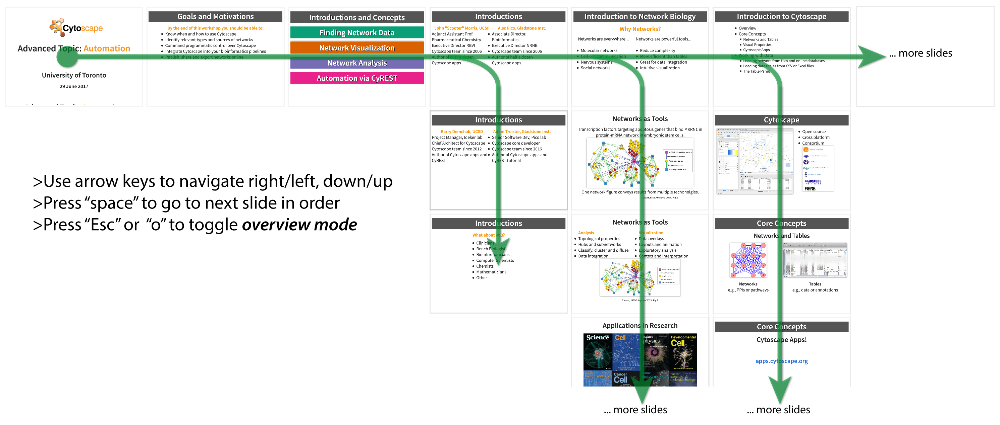

# Cytoscape Tutorials Using Reveal
This repo contains a collection of training '''modules''' for Cytoscape that can be used to compose workshop presentations. The repo also includes a clone of the reveal.js code that enables the presentation mode for these modules and workshops.

## Presentations, Protocols and Modules
Check out the [current list of training materials](https://cytoscape.github.io/cytoscape-tutorials/contents/).

Building upon the powerful framework of reveal.js, we have developed a few custom features and styles tailored for use in Cytoscape training materials. In addition to the contents below, you can learn more about using reveal.js in general from the [reveal-readme](reveal-readme.md).

## Table of Contents
- [Presenting a Cytoscape Tutorial](#presenting)
- [Sharing Cytoscape Tutorials](#sharing)
- [Building Your Own Training Materials](#building)
- [Cytoscape Custom Style](#style)
  - [Version](#version)
  - [Headings](#headings)
  - [Ribbons](#ribbons)
  - [Text](#text)
  - [Animation](#animation)
  - [Lists](#lists)
  - [Columns](#columns)
  - [Tables](#tables)
  - [Images](#images)
  - [Code](#code)
  - [Editing the Cytoscape theme](#editing-cytoscape-theme)
  - [Editing the base theme](#editing-base-theme)	

## Presenting
Browse the available training materials already prepared:
* [presentations](https://cytoscape.github.io/cytoscape-tutorials/modules/contents/#/presentations) -- Specific programs compiled for target audiences; typically composed of custom slides together with general modules (see below).
* [protocols](https://cytoscape.github.io/cytoscape-tutorials/modules/contents/#/protocols) -- General tutorials targeting common workflows or protocols; typically composed of custom slides together with general modules (see below).
* [modules](https://cytoscape.github.io/cytoscape-tutorials/modules/contents/#/modules) -- Concise material focused on specific tasks; intended to be reused in multiple presentations or protocols (see above).

#### Navigating
Use arrow keys, "space" or the on-screen arrows (lower right) to navigate the slides. Take note of modules that are organized ___vertically___ within a presentation.



#### Online
You can access training materials at any time via a web browser. All content is tested in the latest versions of Firefox and Chrome. Simply navigate to the corresponding url, e.g., 

```
https://cytoscape.github.io/cytoscape-tutorials/presentations/advanced-automation.html
```

#### Offline
You can also generate a PDF version of any presentation or protocol and save it as a local file to share or present offline. Note that animated slides do not display as separate slides in PDF form, but rather as single slides in their final form. However, protocols  should be composed in such a way to display properly in PDF. Simply append ```?print-pdf``` to the end of the url for any protocol or protocol module, e.g.,

```
https://cytoscape.github.io/cytoscape-tutorials/protocols/modules/loading-omics-data/index.html?print-pdf#/
```
Then choose File>Print... and set the orientation to ```landscape``` and Save to PDF. Verify that the page breaks are correct throughout the presentation. For longer presentations, you may need to generate the PDF using an alternative approach, see [Decktape and PhantomJS](https://github.com/astefanutti/decktape).

## Sharing
Please feel free to use, share, copy or adapt any of the training materials you find here. They are all implicitly published under the CC0 waiver for maximum resuse potential.

## Building
In order to adapt or compose your own tutorial, and you do not already have edit permissions for this repo, you can simply [fork the repo](https://github.com/cytoscape/cytoscape-tutorials). If your content is of general use, please submit a pull request and we'll be happy to acccept it.  

If you have a suggestion to make regarding the content and don't have the time or inclination to do the coding, please [submit your request in the issue tracker](https://github.com/cytoscape/cytoscape-tutorials/issues).

If you are going to edit a tutorial and are not already familiar with Reveal.js, you will want to [start with the reveal.js docs](reveal-readme.md) to learn how to setup your development environment and the basics of building content.  Once you are familiar with reveal, you will want to review the common elements and custom styles available in our repo for Cytoscape tutorials (see below).

#### Organization
The first thing to notice about our repo is the organization. From the top level, you will find ```presentations``` and ```protocols```. These leverage different CSS styles and different sets of ```modules```. 
```
|--presentations/
|  |--advanced-automation.html
|  |--(other presentations)
|  |--modules/
|     |--intro-cytoscape/
|     |--(other presentation modules)
|--protocols/
|  |--basic-data-visualization.html
|  |--(other protocols)
|  |--modules/
|     |--loading-omics-data/
|     |--(other protocol modules)
```
Each level can contain image assets that are relevant at that level. For example, images that are likely to only be needed in a single module should be kept in that module's directory. Images that might be useful to many tutorials should be kept in the top level's ```assets/images```. 

Each level will have named html files or ```index.html``` files, which are the files that one presents and shares. Modules directories will also have ```module.html``` files which contain the slide content that is referenced and pulled into the presentable html files. For example, the ```index.html``` file for the ```intro-cytoscape``` module includes reveal headers, scripts and this line of code to pull in the slide content:

```
<section data-external="modules/intro-cytoscape/module.html"></section>
```

## Style
We have developed [custom themes for Cytoscape tutorials](https://github.com/cytoscape/cytoscape-tutorials/tree/gh-pages/css/theme). These stylesheets provide settings and features tailored for our content, making it easier to put together (and reuse) training materials in this repo. Review how to use these customizations below...

### Version
To help develop training material that is accurate and current, we developed a custom footer and variable to specify the version of Cytoscape that the content pertains to. You can update the version tag in the named html or index.html files within the footer div:
```
<version>3.5.1</version>
```

### Headings
We have customized heading tags for the Cytoscape tutorial styles:
* ```<h1>``` = Large font with background color and white text, to match Ribbon styles
* ```<h2>``` and others = Black font, no background.

### Ribbons
* ```<ribbon>``` = These are ideal for making interactive Agenda or Outline slides. Ribbons...

### Text

### Animation

### Lists

### Columns

### Tables

### Images

### Code

### Editing Cytoscape Theme

### Editing Base Theme
